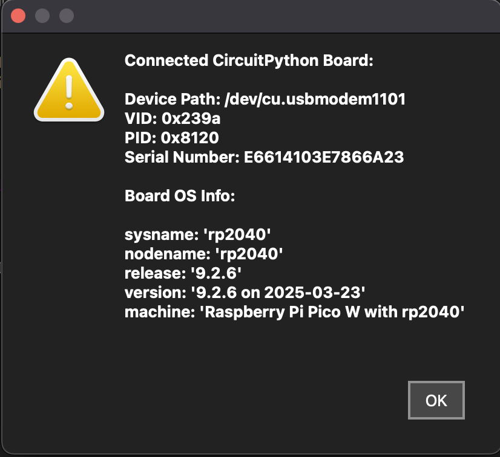
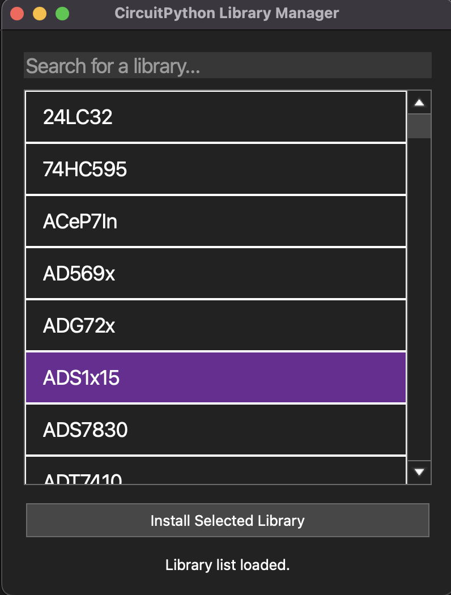

# Mu Editor (CircuitPython Custom Edition)


Mu Editor is a simple Python code editor for beginners, originally designed for microcontroller programming with **CircuitPython**, **MicroPython**, and **Python projects**.

This modified version of Mu Editor v1.0.0 is focused on CircuitPython and includes additional features to simplify development.

> **⚠️ Disclaimer:**  
> I'm **not an expert programmer**—I just made this work for CircuitPython! My coding style might not be perfect, so please **don’t hate me** for it. 😅  
> If you have improvements, feel free to contribute!

---

## ✨ New Features in This Version

- **🔊 GTTS Integration** – Convert text to speech using Google Text-to-Speech (gTTS).
- **📂 New Menu Options** – Additional functionalities in the menu bar.
- **🖥️ Board Information** – Easily check microcontroller details like RAM and storage.
- **📚 Library Manager** – Search, install, and manage CircuitPython libraries.

---

## 📥 Installation

### 1️⃣ Download and Install

Clone the repository and install the dependencies:

```
git clone https://github.com/yourusername/mu-editor-mod.git
cd mu-editor-mod
pip install -r requirements.txt
```
### 2️⃣ Run Mu Editor


---

## ⚙️ Usage

**📌 GTTS (Text-to-Speech)**  
- Offers a menu option to convert text to speech using Google's gTTS.  
- Supports multiple languages and adjustable speech speeds.

**📌 Library Manager**  
- Allows you to search and install CircuitPython libraries directly from Mu Editor.  
- Installed libraries are stored in `Documents/mu_editor/libraries`.  
- Automatically cleans up unnecessary files after extraction.

**📌 Board Information**  
- Displays detailed info of the connected CircuitPython board.

---

## 🖼️ Screenshots




---

## 🤝 Contributing

I know my code might not be the best, but if you like the idea and want to help improve it, please fork the repository and submit pull requests. All contributions are welcome!

---

## 📜 License

This project follows the original Mu Editor <a href=LICENSE>license<a>.
